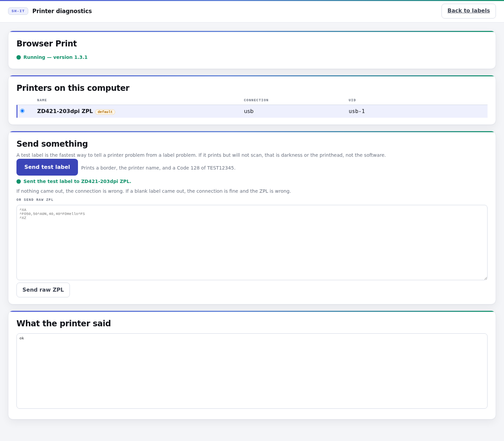
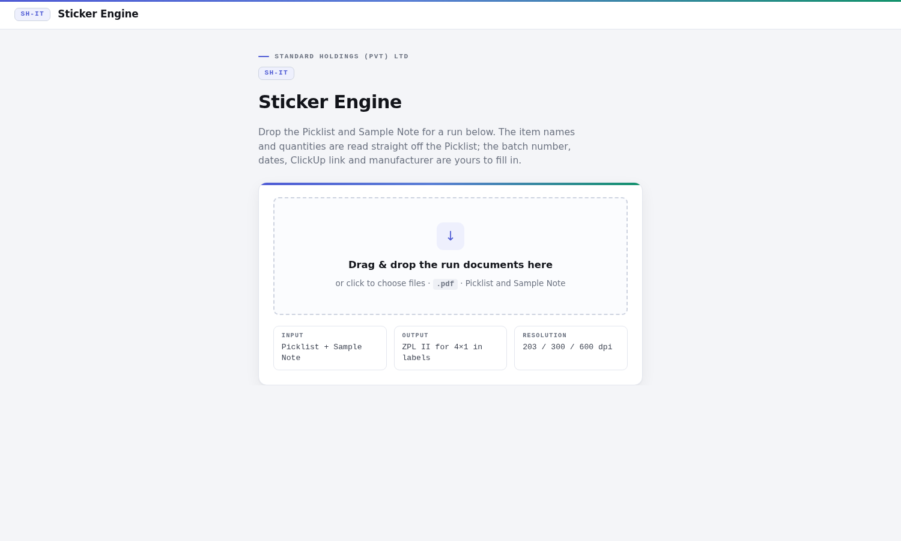
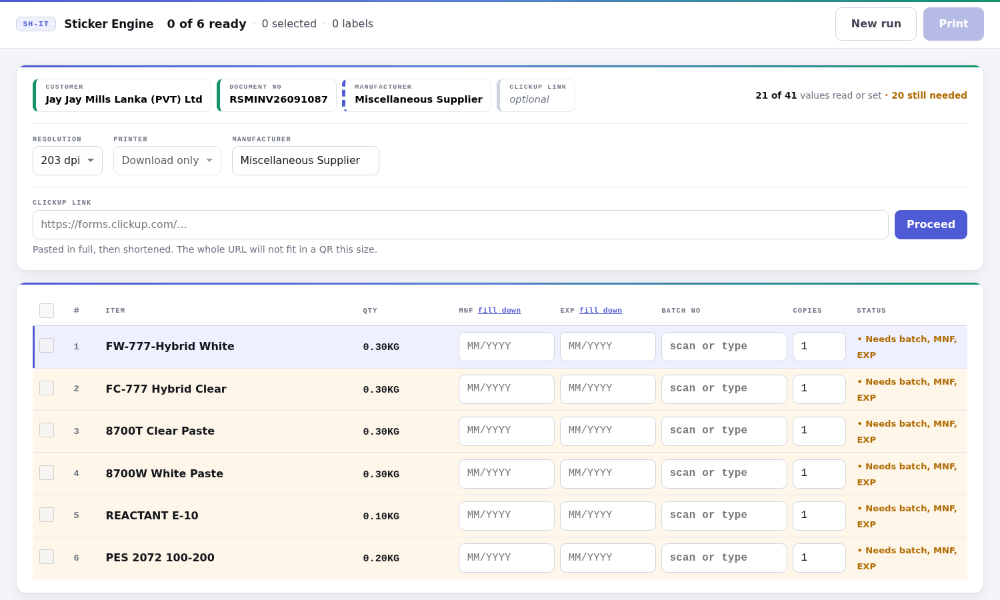
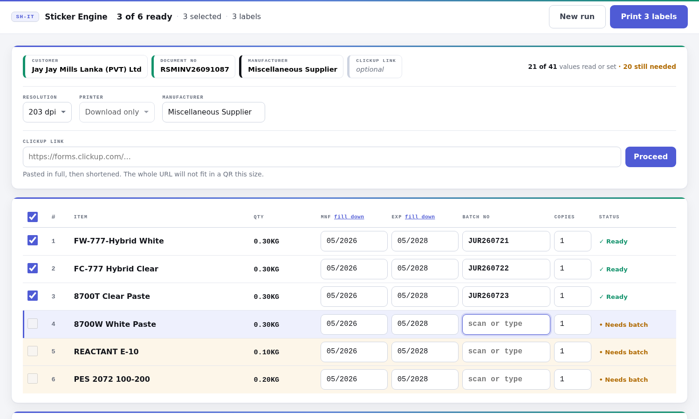
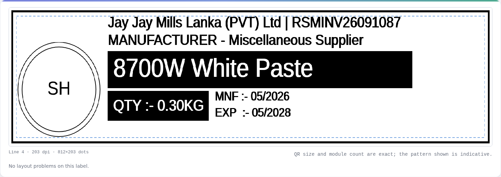
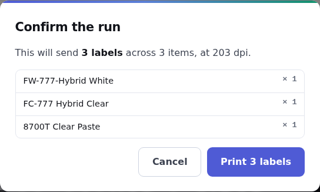
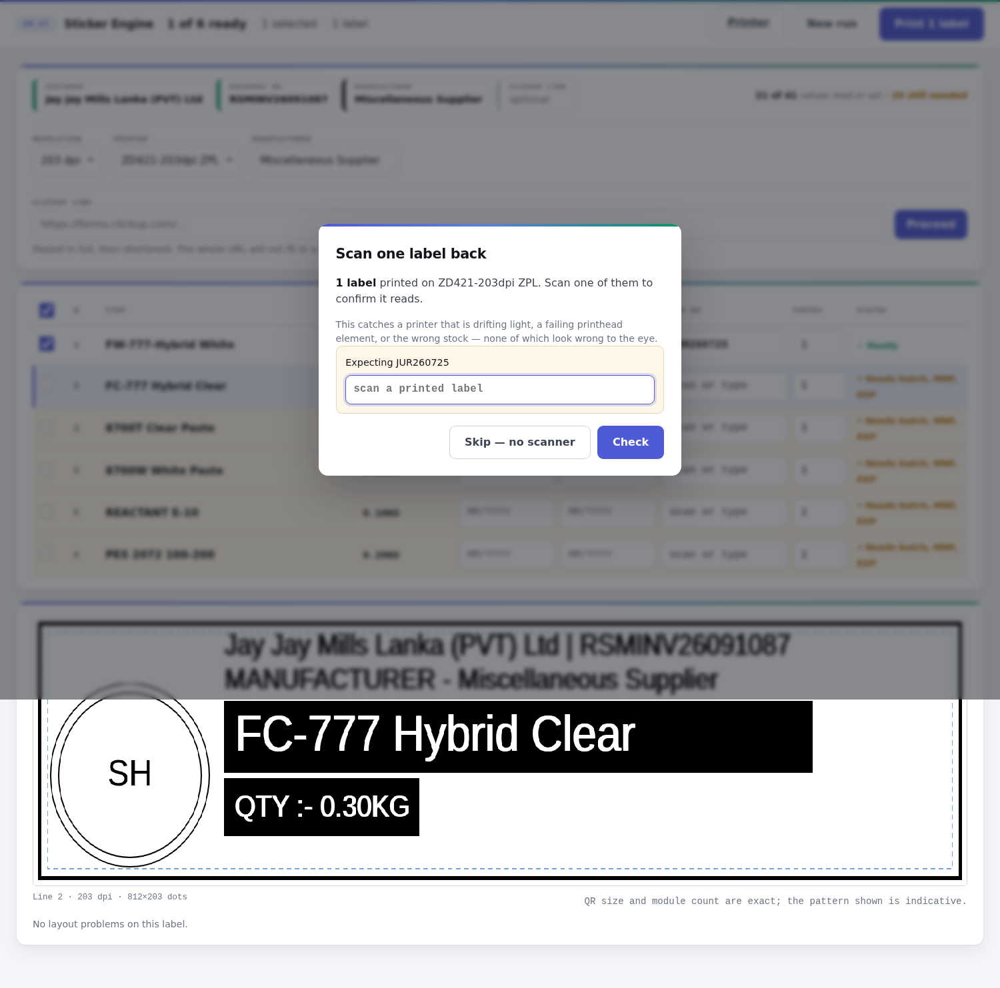

# Printing a run — the operator's guide

Six steps, start to finish. Screenshots are of the real interface.

All six steps work. If Zebra Browser Print is not installed on a machine, the
Print button downloads a `.zpl` file instead, so labels can still be produced.

---

## Once per workstation: install Browser Print

A Zebra on USB cannot be reached by a server, so the browser sends the label
itself. That needs a small Zebra application on each PC.

1. Download Zebra Browser Print from Zebra's support site.
2. Install it and let it run. **It is a tray application, not a service** — it
   has to be running, and it does not always start itself after a reboot.
3. Plug the printer in over USB and switch it on.
4. Open `http://your-server/diagnostics.html`. The printer should appear.
5. Press **Send test label**, then scan the barcode on it.

If the test label prints and scans, that workstation is ready and you never
have to touch this again. If it does not, work down the list in
`docs/prompt-browser-print.md` under "When it does not work" — the order there
rules out one cause per step.

Once per printer, put the logo into its memory:

    cat assets/logo-store.zpl | nc PRINTER-ADDRESS 9100

On USB, send the same file through Zebra Setup Utilities instead. A missing
logo prints a blank square and reports nothing, so the labels come out looking
almost right.

---

## Step 1 — Open the page and drop the documents

Drag the **Picklist** and the **Sample Note** onto the page, or click to choose
them. Order does not matter; each document is recognised by what is inside it.

The Picklist is the one that counts — it carries the item names and the
quantities. The Sample Note supplies the document number printed in the label
header. A Picklist on its own works; the header just has no document number.

---

## Step 2 — Check what was read

The chips along the top show where every value came from:

| Chip | Meaning |
|---|---|
| Green edge | Read from the document |
| Blue dashed edge | Worked out by the system |
| Black edge | Typed by you |
| Amber, tinted | Not set yet |

The count on the right — *21 of 41 values read or set* — is the quick check.
The item names and quantities should already be filled in, straight off the
Picklist and in the unit the Picklist used: `0.30KG`, `310ML`, `1.5L`.

If a quantity looks wrong, the Picklist is what to check. Nothing here converts
units or renames items.

---

## Step 3 — Fill in the five things only you know

Batch number, manufacture date, expiry date, ClickUp link, manufacturer. None of
these appear on any document.

**Work down the grid with the keyboard. Nothing here needs a mouse.**

- Type the **first** MNF and EXP, then press **fill down** in each column
  heading to copy them to every row.
- Then take the batch numbers: click into the first batch field, **scan** or
  type, press **Enter**. The cursor jumps straight to the next row that still
  needs one. Scan, Enter, scan, Enter.
- Dates accept `05/2026`, `5/26`, `052026` or `05-2026` and tidy themselves up
  when you leave the field.
- For the **ClickUp link**, paste the full form URL and press **Proceed**. It
  collapses to a short link with a green, amber or red indicator. Green or amber
  will scan; red will not, and it will tell you why.

A row turns green and says **Ready** when it has everything. Amber rows say
what they are still missing — `Needs batch, MNF, EXP`.

Only ready rows can be ticked for printing, so a half-finished row cannot
quietly end up in a run.

---

## Step 4 — Look at the preview

The preview is the selected row, drawn at the exact dot size the printer uses,
in pure black and white with no smoothing — so what you see is what the
printhead will burn.

Check three things:

1. **Nothing is cut off.** Any problem is outlined on the artwork itself, not
   just listed underneath.
2. **The product name fits.** A long name shrinks automatically; if it has
   shrunk a lot it will say so.
3. **The barcode looks even.** The bars are the real Code 128 for the batch
   number you typed, not a picture of a barcode.

The QR is exact in size and module count. Its *pattern* is indicative — the
printer generates the real one — so do not try to scan the screen.

---

## Step 5 — Confirm the run

The dialog states the exact number of labels and lists every item with its copy
count, **before** anything is sent.

Above 50 labels it will not proceed until you type the number. That is
deliberate: accidentally sending four hundred labels is the mistake this
prevents, and it is not one you can make by muscle memory.

---

## Step 6 — Print, then scan one back

Choose your printer — usually already selected, since the interface remembers
the last one used on this machine — and press **Print**.

The scan-back box opens by itself with the cursor already in it. **Scan one
printed label.** The run is not finished until you have.

The code is compared against what the run should have produced. A match
completes it. A mismatch blocks it and shows which code was expected against
which was read.

This step takes five seconds and catches three things nothing else will:

- **Darkness drift** — bars printing too light to scan
- **A dying printhead element** — a thin white line through every barcode
- **The wrong label stock** — a size or sensor change that shifts the artwork

All three produce labels that look perfectly fine to a person and fail at the
customer. A scanner reading one label back finds them before the pallet moves.

---

## Reprints

Printing a batch number that has been printed before is refused until you give
a reason. That is not bureaucracy: two labels carrying the same batch number in
circulation is a traceability problem, and the reason is what makes it
explainable months later when someone asks.

The reason goes into the audit trail along with who printed it, when, on which
printer, and whether it was verified.

---

## If something looks wrong

| What you see | What it usually is |
|---|---|
| Item names or quantities wrong | The Picklist. Nothing here renames or converts. |
| Dates wrong by months | `STICKER_DATE_ORDER`. `09/04/2026` is 4 September under MDY, 9 April under DMY. |
| Red QR indicator | The link is too long. Press **Proceed** to shorten it. |
| Barcode prints but will not scan | Darkness or the printhead — the preview would have warned about geometry. |
| Labels print with a blank square | The logo is not in printer memory. Re-send `assets/logo-store.zpl`. |
| Printer not in the list | Browser Print is not running — it is a tray application — or the USB cable. Open `/diagnostics.html`. |
| "Browser Print is not running" but it is | The page is on HTTPS, which cannot reach its HTTP service. Open the page over `http://` instead. |

Every error carries a request id. Quote it and `docs/errors.md` will say what
it means.
